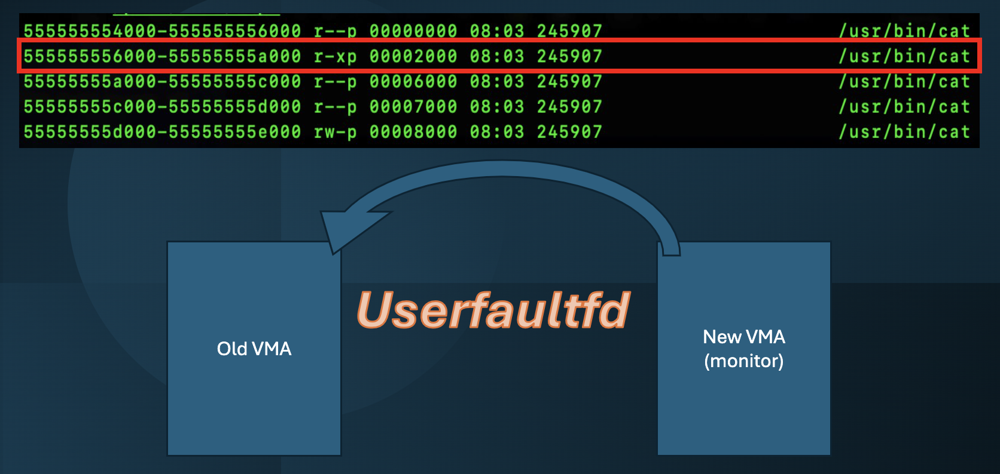

# 

Uffd-monitor is a userspace code execution monitor that reduces executable code in memory. It creates a sliding window over the code pages of the target application. The size of this sliding window can be configured. It helps in reducing the software attack surface of the target executables.



Uffd-monitor supports multithreaded applications and has a buggy albeit basic framework set up to support multiprocessed applications using [CRIU parasite](https://criu.org/Parasite_code).

# Get Started

## Prerequisites

Install packages required by [CRIU](https://criu.org/Installation). You can use the following command on Ubuntu 22.04:-
```zsh
sudo apt update
sudo apt upgrade -y
sudo apt install -y libprotobuf-dev libprotobuf-c-dev protobuf-c-compiler protobuf-compiler \
    pkg-config libnl-3-dev libnet1-dev libcap-dev libbsd-dev python3-pip cmake
```
Build CRIU v3.19:-
```zsh
git submodule update --init --recursive
make -C criu-3.19 -j`nproc`
```

## Build and run

Set the uffd-monitor home and build the monitor simply by using:-
```zsh
export UFFD_MONITOR_HOME=$(pwd)
make
```
This will create a shared library file called `libuffd.so`, which is the monitor. As aforementioned, the monitor essentially creates a sliding window over the code pages of the target executable. You can set the size of this sliding window using the environment variable `UFFD_MONITOR_SIZE`. The default size is 1 page. Also, optionally, you can choose for a monitor log to be dumped to stderr by setting the environment variable `UFFD_LOG_DUMP` to 1. In order to run an application under the monitor, it must load the monitor (a shared library). To ensure this, you can set the environment variable `LD_PRELOAD` to `./libuffd.so`. Hence, you can run the application under the monitor using:-
```zsh
sudo UFFD_MONITOR_SIZE=1 UFFD_LOG_DUMP=1 LD_PRELOAD=./libuffd.so ./application
```
By default, **Linux 5.11+** restricts `userfaultfd` to privileged users unless explicitly allowed. You can check the permission with:-
```zsh
cat /proc/sys/vm/unprivileged_userfaultfd
```
If set to 1, unprivileged users can run `userfaultfd` without `sudo`.

## Demos

You can see some simple applications in action using the following `make` targets:-
```zsh
make run1 # run a simple I/O application
make run2 # run a simple counter that keeps incrementing
```
You can see a little bigger application, a tiny web epoll server, in action using the `make` target:-
```zsh
make run4 # run a single-processed epoll server
```
You can see a real-world application, [lighttpd](https://www.lighttpd.net/), in action using the make target:-
```zsh
make run5 # run lighttpd
```
You can see a multithreaded application (a basic shared counter) in action using the make target:-
```zsh
make run7 # run a multithreaded counter
```
You can configure the `UFFD_MONITOR_SIZE` and the `UFFD_LOG_DUMP` options in the Makefile.

# Performance Evaluation

Install SPEC CPU 2017 benchmark and source `shrc` (or equivalent). Make sure the environment variable `UFFD_MONITOR_HOME` has been set to `/path/to/uffd-monitor` and follow the following steps:-
```zsh
# Copy the uffd-monitor config over to SPEC CPU
cp $UFFD_MONITOR_HOME/eval/uffd-monitor-eval.cfg $SPEC/config

# Build the nexessary binaries
cd $SPEC
runcpu --action=build --config=uffd-monitor-eval --size=test leela_s mcf_s deepsjeng_s xz_s

# Copy the nexessary binaries over
go leela_s # shrc (or equivalent) must be sourced
cd build/build_base_test_uffd-monitor-eval-m64.0000
cp leela_s $UFFD_MONITOR_HOME/eval/specs/leela_s

go mcf_s
cd build/build_base_test_uffd-monitor-eval-m64.0000
cp mcf_s $UFFD_MONITOR_HOME/eval/specs/mcf_s

go deepsjeng_s
cd build/build_base_test_uffd-monitor-eval-m64.0000
cp deepsjeng_s $UFFD_MONITOR_HOME/eval/specs/deepsjeng_s

go xz_s
cd build/build_base_test_uffd-monitor-eval-m64.0000
cp xz_s $UFFD_MONITOR_HOME/eval/specs/xz_s

cd $UFFD_MONITOR_HOME
make eval
```
The results should be written to the file `/tmp/eval.out`. This output file path can be configured in the Makefiles of the individual specs. Navigate to the desired spec in `eval/specs` and update the `OUTFILE` field. Similarly, the window sizes for which the evaluation is run can be configured in the individual spec Makefiles. Navigate to the desired spec in `eval/specs` and update the `TEST_SIZES` field.

## Results