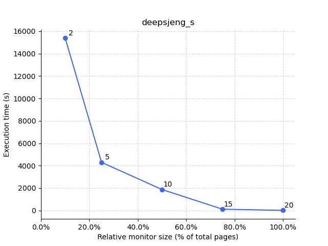
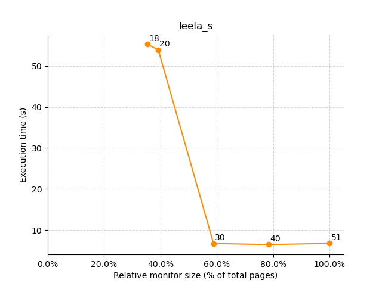
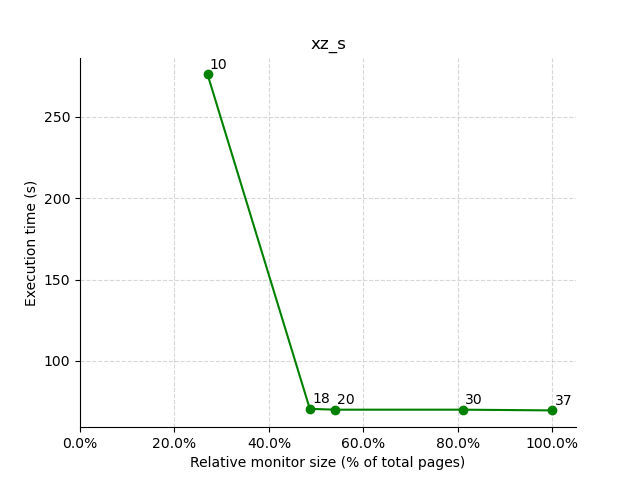
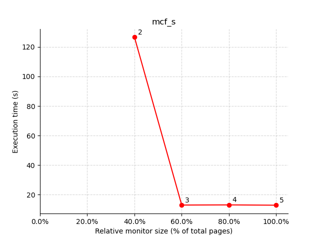

# 

Uffd-monitor is a userspace code execution monitor that reduces executable code in memory. It creates a sliding window over the code pages of the target application. The size of this sliding window can be configured. It helps in reducing the software attack surface of the target executables.


Uffd-monitor supports multithreaded applications and has a buggy albeit basic framework set up to support multiprocessed applications using [CRIU parasite](https://criu.org/Parasite_code).

# Get Started

## Prerequisites

Install packages required by [CRIU](https://criu.org/Installation). You can use the following command on Ubuntu 22.04:-
```zsh
sudo apt update
sudo apt upgrade -y
sudo apt install -y libprotobuf-dev libprotobuf-c-dev protobuf-c-compiler protobuf-compiler \
    pkg-config libnl-3-dev libnet1-dev libcap-dev libbsd-dev python3-pip cmake
```
Build CRIU v3.19:-
```zsh
git submodule update --init --recursive
make -C criu-3.19 -j`nproc`
```

## Build and run

Set the uffd-monitor home and build the monitor simply by using:-
```zsh
export UFFD_MONITOR_HOME=$(pwd)
make
```
This will create a shared library file called `libuffd.so`, which is the monitor. As aforementioned, the monitor essentially creates a sliding window over the code pages of the target executable. You can set the size of this sliding window using the environment variable `UFFD_MONITOR_SIZE`. The default size is 1 page. Also, optionally, you can choose for a monitor log to be dumped to stderr by setting the environment variable `UFFD_LOG_DUMP` to 1. In order to run an application under the monitor, it must load the monitor (a shared library). To ensure this, you can set the environment variable `LD_PRELOAD` to `./libuffd.so`. Hence, you can run the application under the monitor using:-
```zsh
sudo UFFD_MONITOR_SIZE=1 UFFD_LOG_DUMP=1 LD_PRELOAD=./libuffd.so ./application
```
By default, **Linux 5.11+** restricts `userfaultfd` to privileged users unless explicitly allowed. You can check the permission with:-
```zsh
cat /proc/sys/vm/unprivileged_userfaultfd
```
If set to 1, unprivileged users can run `userfaultfd` without `sudo`.

## Demos

You can see some simple applications in action using the following `make` targets:-
```zsh
make run1 # run a simple I/O application
make run2 # run a simple counter that keeps incrementing
```
You can see a little bigger application, a tiny web epoll server, in action using the `make` target:-
```zsh
make run4 # run a single-processed epoll server
```
You can see a real-world application, [lighttpd](https://www.lighttpd.net/), in action using the make target:-
```zsh
make run5 # run lighttpd
```
You can see a multithreaded application (a basic shared counter) in action using the make target:-
```zsh
make run7 # run a multithreaded counter
```
You can configure the `UFFD_MONITOR_SIZE` and the `UFFD_LOG_DUMP` options in the Makefile.

# Performance Evaluation

Install SPEC CPU 2017 benchmark and source `shrc` (or equivalent). Make sure the environment variable `UFFD_MONITOR_HOME` has been set to `/path/to/uffd-monitor` and follow the following steps:-
```zsh
# Copy the uffd-monitor config over to SPEC CPU
cp $UFFD_MONITOR_HOME/eval/uffd-monitor-eval.cfg $SPEC/config

# Build the nexessary binaries
cd $SPEC
runcpu --action=build --config=uffd-monitor-eval --size=test leela_s mcf_s deepsjeng_s xz_s specrand_is
BUILD_DIR=build/build_base_uffd-monitor-eval-m64.0000

# Copy the necessary binaries over
go leela_s # shrc (or equivalent) must be sourced
cp $BUILD_DIR/leela_s $UFFD_MONITOR_HOME/eval/specs/leela_s

go mcf_s
cp $BUILD_DIR/mcf_s $UFFD_MONITOR_HOME/eval/specs/mcf_s

go deepsjeng_s
cp $BUILD_DIR/deepsjeng_s $UFFD_MONITOR_HOME/eval/specs/deepsjeng_s

go xz_s
cp $BUILD_DIR$/xz_s $UFFD_MONITOR_HOME/eval/specs/xz_s

go specrand_is
cp $BUILD_DIR/specrand_is $UFFD_MONITOR_HOME/eval/specs/specrand_is

cd $UFFD_MONITOR_HOME
make eval
```
The results should be written to the file `/tmp/eval.out`. **Note that the script *appends* to the output file and so you should delete the file explicitly before each run for clean output.** This output file path can be configured in the Makefiles of the individual specs. Navigate to the desired spec in `eval/specs` and update the `OUTFILE` field. Similarly, the window sizes for which the evaluation is run can be configured in the individual spec Makefiles. Navigate to the desired spec in `eval/specs` and update the `TEST_SIZES` field.

## Results

The variable **relative monitor size** used in the performance evaluation refers to the size of the sliding window over the code pages of the binary in terms of number of pages **as a percentage of the total number of code pages**. Each data point in each plot is annotated with the absolute monitor size in terms of number of pages. If the annotation corresponds to a 100% relative monitor size, then it is the total number of code pages.

### For SPEC CPU benchmarks

The performance of uffd-monitor is evaluated on four SPEC CPU integer computation speed benchmarks: deepsjeng_s, leela_s, xz_s, and mcf_s. The following plots show the performance of uffd-monitor in terms of execution time in seconds vs. relative monitor size.






The plots show that the trend of execution time as compared to monitor size largely depends on the application. Among the SPEC CPU benchmarks used for evaluation, on the one hand, leela_s shows significant performance overhead until an absolute monitor size of 18, after which there is a sharp decline and steadiness. On the other hand, deepsjeng_s shows a systematic decline of execution time with increasing absolute monitor size. One reason for this could be that most of the execution of leela_s would be happening in about 20 pages, and constant page faults due to a strictly lesser monitor size account for significant performance overhead. One general trend that can be observed is that the execution time attains a steady state as the relative monitor size tends to 100%. Also, an absolute monitor size of 1 or 2 generally results in significant performance overhead.

### For the lighttpd server

The performance of uffd-monitor is evaluated using the lighttpd web server in terms of time per request in milliseconds vs. relative monitor size.

